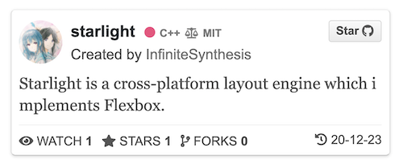

# react-github-repo-panel  


A beautiful card that displays Github repository infos.


<p align="center"></p>

## Demo Show

- **Online** [Demo Webside](https://infinitesynthesis.github.io/react-github-repo-panel/)

- **Local**

    ```shell
    git clone https://github.com/InfiniteSynthesis/react-github-repo-panel.git
    cd react-github-repo-panel
    npm i
    npm start
    ```
    open `localhost:3001`


## How to Use 🍕

1. install
    ```shell
    npm i react-github-repo-panel
    ```

1. import
    ```javascript
    import import { RepoCard } from 'react-github-repo-panel'
    ```

2. use
    ```javascript
    <RepoCard repo={repoData} />
    ```

## Settings 🔨

| Parameter   | Type           | Default  | Description|
| :----------: |:---:| :---:| :------------- |
| `repo` | Object | "" | Repository data. |
| `center` | Boolean | false | If card is aligned center. |
| `squareAvatar` | Boolean | false | If avatar is displayed with square outline. |
| `descriptionLine` | Number | 2 | The maximum line of repo description. |
| `showLanguage` | Boolean | true | If the  repo language is displayed. |
| `showLicense` | Boolean | true | If the  repo license is displayed. |
